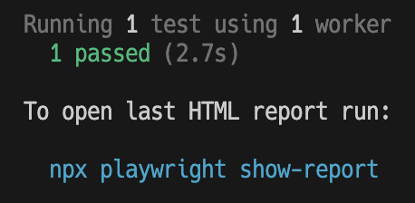
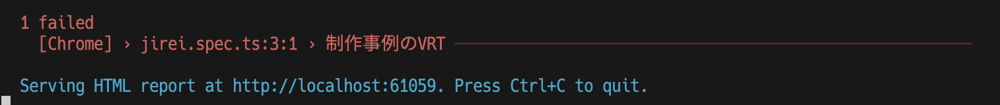
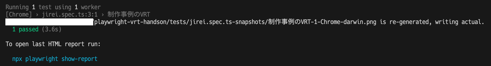

# Visual Regression Testing基本編

## PlaywrightでVisual Regression Testingを実行してみよう

### Playwrightでテストを実行する

一度テストを実行してみましょう。[tests/jirei.spec.ts](../tests/jirei.spec.ts)のテストが実行されます。

```bash
npx playwright test
```

テスト終了後に自動でレポートがブラウザに開かれます(<http://localhost:9323>)。
確認できたらタブを閉じて、PlaywrightをCtrl+Cで終了しましょう。

### 初回テスト実行後

初回実行時は必ずテストに失敗します。


比較するスナップショットがないためです。
テストを実行した際、比較画像が存在しない場合は自動で画像が追加されます。

```text
- tests/
  - jirei.spec.ts-snapshots/ <-テストで追加
    - 制作事例のVRT-1-Chrome-{OS名}.png <- テストで追加
```

### もう一度テストを実行する

もう一度Playwrightでテストを実行してみましょう。



今度はテストに成功するはずです！
先ほどと全く同じHTMLのスクリーンショットを取得しているため、前回実行時のスナップショットと一致します。

ここまでの変更をコミットしましょう。

## 差分を検出する

ではVRTの肝である差分検出機能を試してみましょう。

### HTMLに変更を加える

先ほどスナップショットを保存した[static/jirei.html](../static/jirei.html)を編集し、保存しましょう。
ブラウザ上で視認できれば、文字の追加、改行の追加、スタイル（CSS）のどれでも構いません。

例：

```html
<!-- headタグの最後に追加 -->
<style>
  body {
    color: red important!;
  }
</style>
```

</details>

### テストで差分を検出する

もう一度Playwrightでテストを実行してみましょう。



今度はテストに失敗するはずです。
先程の変更で異なるUIが出力されたためです。

自動で開かられるレポートから差分を確認してみましょう。

## スナップショットを更新する

上記で検出した差分をすべて意図通りだったして、差分を更新をしましょう。

テストコマンドに`--update-snapshots`（`-u`）オプションを追加するだけで、新しい画像に更新できます。

```bash
npx playwright test --update-snapshots
```

ログからも更新されたことを確認できます。



ここまでの変更をコミットしましょう。

基本的なVRTの利用方法は以上になります。
