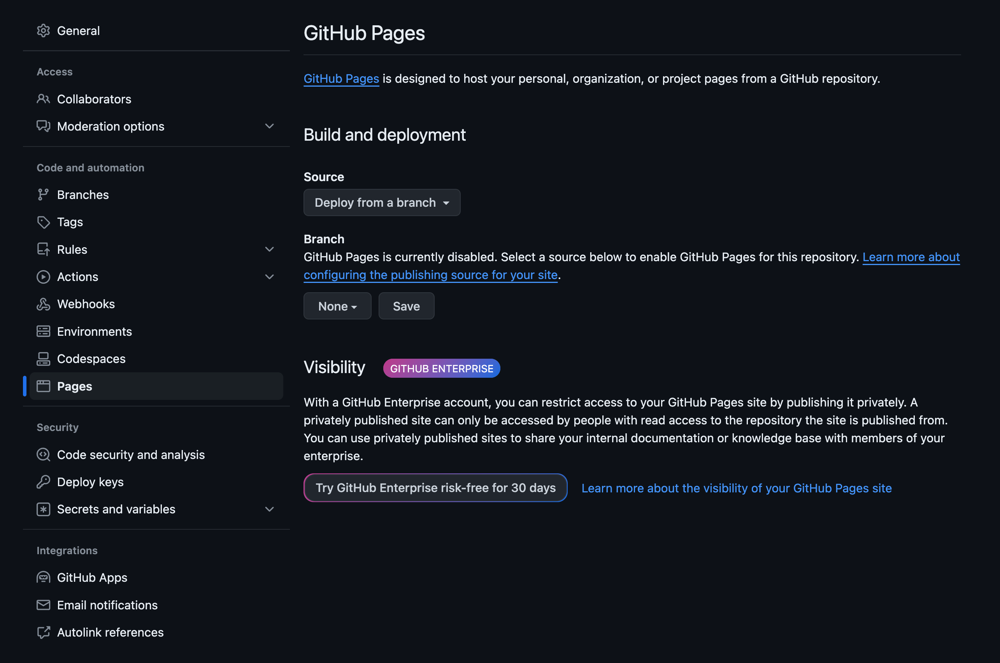
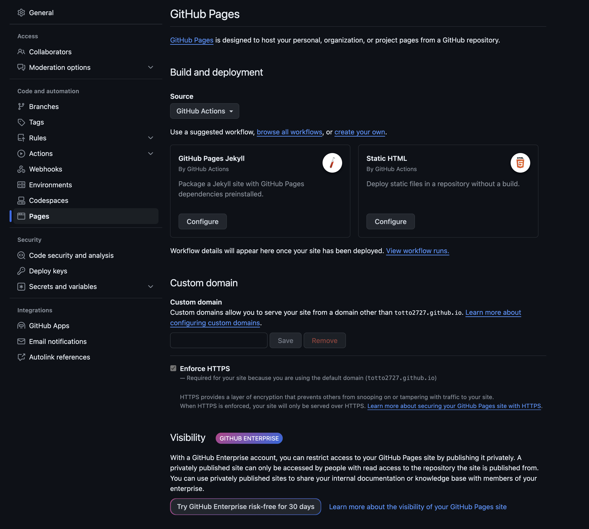
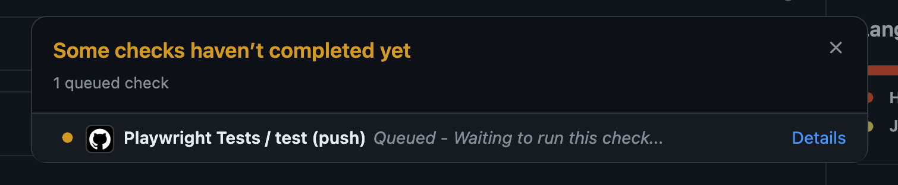
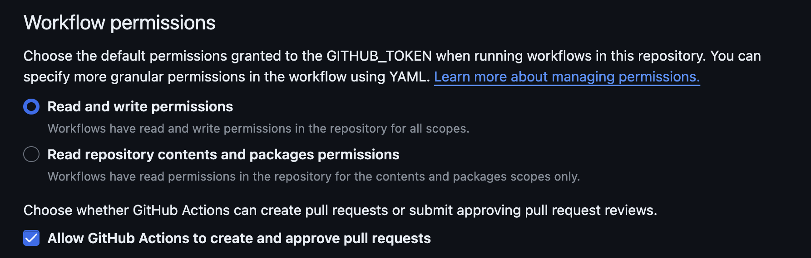
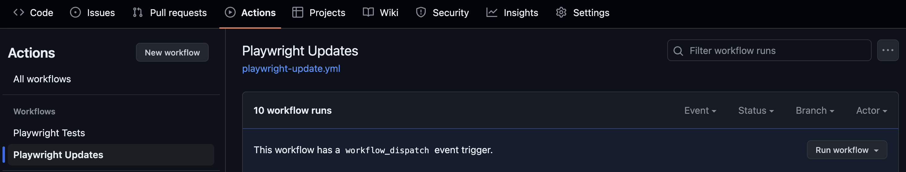

# 自動テスト編

ここまででVRTの概要と使い方について説明してきました。
手動であっても十分有用なテスト手法ですが、ページ数が増えてくればローカルで実行するのは億劫になります。

この勉強会ではGitHub Actions（以下GHA）を利用して、テストとレポートのホスティングを自動化していきます。

## 準備

### GitHub Actionsを有効にする

以下のコメント部分をコメントアウトしましょう。

```yaml
    branches-ignore:
      - "**"
```

### GitHub Pagesを有効にする

GitHubの設定画面に移動してください。



Sourceをクリックし、GitHub Actionsを選択しましょう。



## CI/CDパイプラインを実行する

ここまでの変更をコミットして、プッシュしてみましょう。

プッシュが完了したら自身のリポジトリを確認してみましょう。
コミット履歴に以下のようなマークが付与され、カーソルを合わせるとGitHub Actionsのワークフローが実行されていることがわかります。


Detailsをクリックし、どのように実行されているか確認しましょう。



GitHub ActionsではLinuxを用いて実行しているため、多くの方はテストに失敗するはずです。

## レポートを閲覧する

<https://{GitHubのユーザー名}.github.io/playwright-vrt-handson/>でローカルと同じPlaywrightのレポートを開くことができます。

> [!WARNING]
>
> テストを実行する度に上書きされる点に注意してください。

## Linux向けのスナップショットを生成する

### 設定の確認

Actionsにリポジトリを操作する権限を与える必要があります。
以下のような設定になっていれば問題ありません。



> [!TIPS]
>
> おそらくGitHubの設定をほぼデフォルトで運用されている方は設定不要です。

### ワークフローの実行

`Playwright Updates`ワークフローを手動で実行します。
今回は`main`ブランチを対象に実行しましょう。



ワークフローに成功するとスナップショット更新用のワークフローが追加されるはずです。
このPRをmainに取り込むと再度テストが実行され、テストに成功します。

これ以降は以下のような手順で開発することができます。

- ローカルで開発
- コミット＆プッシュ
- PRを作成
- VRTでUIの差分を確認
- スナップショットを更新
- mainにマージ
